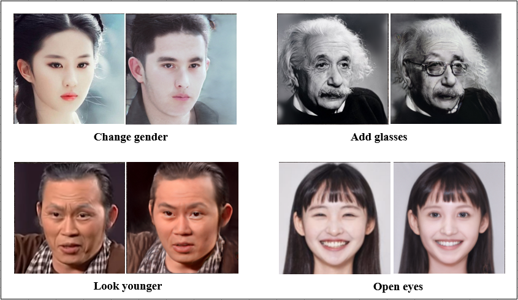
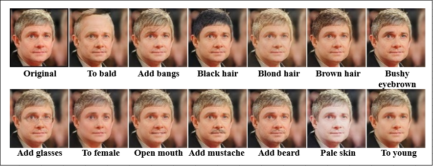
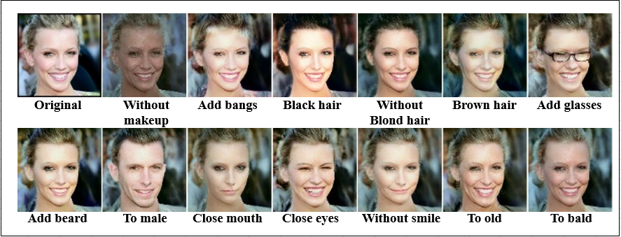

# Facenix project
> Facenix is a face attribute manipulating application. This app is deployed by using Django web framework with STGAN and StyleGAN models as backend.

Video demonstration: [Youtube](https://youtu.be/H-bU4cEvkIA)


## Usage
- Environment
   - Python 3.6
   - TensorFlow 2.1.0
   - OpenCV, Django, scikit learn,...

   - *We recommend [Anaconda](https://www.anaconda.com/distribution/#download-section) or [Miniconda](https://docs.conda.io/en/latest/miniconda.html#linux-installers), then you can create the environment with commands below*
     ```console
     conda create -n tf2 python=3.6
     conda activate tf2
     pip install --upgrade pip
     pip install tensorflow==2.1.0
     pip install tensorflow_addons
     pip install django
     pip install dlib
     pip install opencv-python
     pip install sklearn
     pip install pillow
     pip install requests matplotlib
     
     ```

- Run web application
   *All commands are run from facenix directory after "git clone"*
   - Download pre-trained models
      - pretrained_weights.zip (move to **facenix/pretrained_weights.zip**): [Google Drive](https://drive.google.com/open?id=197Y3FMQROjMPbDZUnRvySDNzGJjNtvyF)
   - Unzip the models
      ```console
      unzip ./pretrained_weights.zip
      ```
   - Run web application
      ```console
      cd web_app
      ./runserver.sh
      ```
   - Open web browser. Go to http://127.0.0.1:8000/. After the web page is loaded, you can try your own sample. If you would like to run web server on specific IP and port, you can pass it as arguments.
      ```console
      e.g.
      ./runserver.sh 192.168.1.254:8888
      ```

- Re-training models
   - Make sure to clean all previous training
      ```console
      ./clean_all.sh
      ```

   - STGAN dataset preparation: CelebA aligned
      - download the dataset
         - img_align_celeba_crop_128.zip (move to **facenix/data/img_align_celeba.zip**): [Google Drive](https://drive.google.com/open?id=1WUFjHg_7OCeQi74ldxfA4ixRvymK5d4Y)
         - list_attr_celeba.txt (move to **facenix/data/list_attr_celeba.txt**): [Google Drive](https://drive.google.com/open?id=1t52Zm_9AyJ2oe4QDsLBOPVQ3rLRKWuZz)
 
      - unzip the dataset
         ```console
         cd data
         unzip ./img_align_celeba.zip
         ```

   - StyleGAN dataset preparation: CelebA-HQ
      - download the dataset
         - CelebAMask-HQ.zip (move to **facenix/data/CelebAMask-HQ.zip**): [Google Drive](https://drive.google.com/open?id=17qClHYuyPp4VgOrb1OjOAqLnDrkxTY2-)
 
      - unzip the dataset
         ```console
         cd data
         unzip ./CelebAMask-HQ.zip
         ```

   - Train STGAN
      ```console
      cd stgan
      python train.py --experiment_name origin
      ```

   - Train StyleGAN
      - Train generator      
         ```console
         cd stylegan
         python train.py --experiment_name origin
         ```

      - Train classifier
         ```console
         cd classifier
         ./train_all.sh
         ```

      - Train attribute vectors
         ```console
         cd boundary_finder
         python data.py
         python train.py
         ```
- Samples STGAN


- Samples StyleGAN


## Known issues
- Attribute editing is not always successful.
- When editing with StyleGAN, the same picture could be led to different results each time the image is uploaded.
- The web server can serve 1 user each time due to high computing cost.

## Reference
- [STGAN](https://arxiv.org/abs/1904.09709)
- [StyleGAN](https://arxiv.org/abs/1812.04948)


